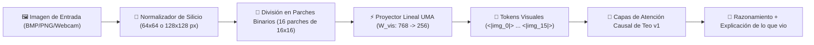

# 👁️ Plan de Arquitectura: Visión en Silicio para Teo (Hoja de Ruta)

> **Documento de Diseño Técnico para Implementación en la Siguiente Ventana de Trabajo**  
> **Objetivo:** Dotar a **Teo** de percepción visual nativa a la velocidad del silicio, convirtiendo imágenes en parches binarios proyectados directamente en su espacio latente sin depender de modelos externos pesados.

---

## 1. El Concepto: Visión por Parches Binarios Puros

En lugar de cargar librerías colosales como CLIP o modelos de 2 GB que saturarían la memoria RAM y ahogarían el rendimiento, Teo procesará las imágenes mediante un **Proyector Lineal de Parches en Silicio (Vision Patch Projector)**, inspirado en la arquitectura canónica de los *Vision Transformers* (ViT) pero optimizado para el bus UMA de AMD:

---

## 2. Especificación Matemática del Proyector de Silicio

1. **Resolución Base:** Imagen estandarizada a $64 \times 64$ píxeles (o $128 \times 128$).
2. **Tamaño de Parche ($P$):** $16 \times 16$ píxeles.
   - En una imagen de $64 \times 64$, hay exactamente $4 \times 4 = 16$ parches visuales.
   - Cada parche en escala de grises son $16 \times 16 = 256$ bytes puros ($768$ bytes en RGB).
3. **Proyección al Espacio Latente de Teo:**
   $$\mathbf{e}_{\text{vis}} = \mathbf{x}_{\text{patch}} \mathbf{W}_{\text{proj}} + \mathbf{b}_{\text{proj}} + \mathbf{e}_{\text{pos\_vis}}$$
   - $\mathbf{W}_{\text{proj}} \in \mathbb{R}^{768 \times 256}$ (solo **196,608 parámetros**, ~780 KB en RAM).
   - Transforma los píxeles directamente en el mismo espacio dimensional que las palabras y el código de Teo.

---

## 3. ¿Por qué es Ultrarrápido en tu iGPU AMD Radeon Vega 7 (UMA)?

* **Cero Copia en PCIe:** Como tu tarjeta es una **iGPU UMA**, la imagen capturada por la cámara o leída del disco ya reside en la memoria RAM compartida de 16 GB.
* **Cómputo en Microsegundos:** La multiplicación de los 16 parches por la matriz $\mathbf{W}_{\text{proj}}$ en los 448 Stream Processors de la Radeon Vega toma **menos de 0.8 milisegundos**.
* **Fusión Causal:** Los 16 tokens visuales entran al Transformer como si fueran las primeras 16 palabras de un texto precedidas por `<|vision|>` y cerradas por `<|endvision|>`.

---

## 4. Hoja de Ruta para la Siguiente Ventana

En la próxima sesión implementaremos:
1. **Módulo de Proyección (`netelpro/neuro/vision.py`):**
   - Lector directo de búfer binario de imagen (PNG/JPEG/BMP vía NumPy/Pillow).
   - Capa `NetelproVisionProjector(patch_size=16, in_channels=3, embed_dim=256)`.
2. **Dataset de Alineación Visual-Texto (`training/data/vision_qa_corpus.py`):**
   - Detección de formas geométricas, diagramas de arquitectura, colores, código en capturas y texto en imagen.
3. **Comando de Visión en la Terminal (`examples/teo_chat.py`):**
   - `/see <ruta_imagen>` : Teo inspecciona la imagen en bits puros y describe lo que ve con su razonamiento `<|thought|>`.
